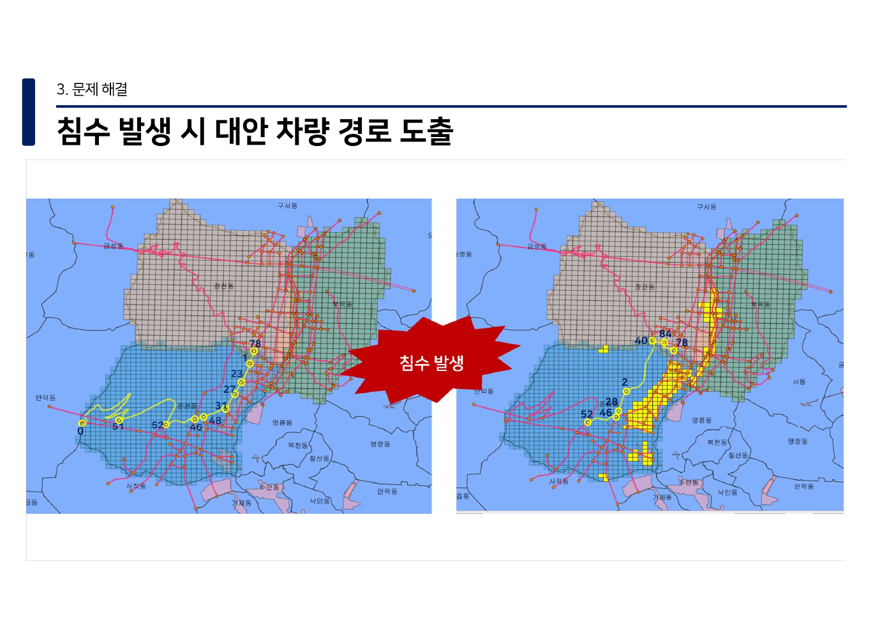

# 부산 침수 예측 · 강화학습 경로 모델링

> 침수 위험 특성과 도로 상태를 분리해 다루고, 예측 결과를 강화학습의 보상 설계에 연결하는 팀 프로젝트입니다.

## 프로젝트 개요

| 항목 | 내용 |
| --- | --- |
| 주제 | 침수 발생 예측과 침수 상황을 고려한 경로 의사결정 모델링 |
| 기간 | 2022년 2학기 |
| 형태 | 대학 팀 프로젝트 |
| 공개 범위 | 코드 구조·재현 절차와 검토된 정적 경로 시각화 1장만 공개, 원본 데이터·실행 결과·수업 산출물은 비공개 |

## 실제 결과 화면



<sub>2022년 최종 발표 장표에서 공개한 시뮬레이션 화면입니다. 침수 발생 격자(노란색)와 도로 네트워크 위의 차량 경로를 함께 표시합니다. 실제 운행 권고·교통 통제 결과가 아닙니다.</sub>

### 담당 기여

침수 예측 모델과 강화학습 모델링을 수행했습니다.

## 문제와 접근

침수 대응에서는 지형·배수시설·강수량처럼 서로 다른 특성을 함께 고려해야 하고, 도로의 통행 가능 여부는 경로 의사결정에 직접 영향을 줍니다. 이 프로젝트는 다음의 두 모델링 흐름을 하나의 분석 파이프라인으로 정리했습니다.

1. **침수 예측** — 격자 단위의 지형, 배수시설 거리·용량, 시간당 강수량을 입력 특성으로 구성하고, 불균형 분류를 고려해 랜덤 포레스트 기반의 검증 흐름을 설계했습니다.
2. **강화학습 경로 의사결정** — 침수 상태가 반영된 도로 그래프를 환경으로 보고, 가능한 다음 이동을 행동으로 정의한 Q-learning 예제를 구성했습니다. 보상은 목적지 도달과 이동 비용·침수 위험의 균형을 표현하도록 설계합니다.

원본 팀 작업에는 다른 방법과 도구가 함께 사용됐지만, 이 저장소는 위의 확인된 개인 모델링 기여만을 보여 주도록 범위를 제한합니다.

## 저장소 구성

```text
.
├── notebooks/
│   └── flood-routing-modeling.ipynb  # 정리된 모델링 워크스루
├── docs/
│   ├── data-sources.md               # 공개 가능한 출처 범주와 한계
│   ├── reproducibility.md            # 재현 조건과 검증 공백
│   └── usage.md                      # 실행 순서
├── data/README.md                    # 비공개 입력 데이터 계약
├── results/README.md                 # 결과 공개 정책
├── assets/README.md                  # 시각 자산 공개 정책
├── scripts/validate-public-release.ps1
└── requirements.txt
```

## 모델링 흐름


- 분류 단계에서는 데이터 분할 뒤 학습 데이터에만 오버샘플링을 적용해 검증 누수를 피합니다.
- 경로 단계에서는 도로 링크의 거리와 침수 상태를 명시적으로 입력으로 두며, 실제 운행 권고나 서비스 배포를 목적으로 하지 않습니다.
- 이 저장소에는 원본 입력 데이터나 실행 산출물이 없으므로 모델 성능 수치나 경로 비교 결과를 주장하지 않습니다.

## 빠른 시작

```powershell
python -m venv .venv
.\.venv\Scripts\Activate.ps1
pip install -r requirements.txt
jupyter notebook notebooks/flood-routing-modeling.ipynb
```

실행에는 별도로 승인된 비공개 입력 파일이 필요합니다. 파일 계약, 실행 순서와 제한 사항은 [사용 가이드](docs/usage.md)와 [재현성 문서](docs/reproducibility.md)에 정리했습니다.

## 공개·재현성 원칙

- 원본 수업 노트북, 원시 GIS·강수·도로 데이터, 슬라이드, 이미지, 성능 출력은 포함하지 않습니다.
- 데이터의 라이선스·재배포 권한을 이 저장소에서 보장하지 않습니다. 재현을 시도할 때는 각 제공기관의 최신 이용 조건을 별도로 확인해야 합니다.
- 공개 전 파일 범위는 [검증 스크립트](scripts/validate-public-release.ps1)로 점검합니다.

## 문서

- [데이터 출처와 공개 경계](docs/data-sources.md)
- [재현성·검증 상태](docs/reproducibility.md)
- [실행 가이드](docs/usage.md)

## 라이선스

이 저장소에는 별도 라이선스를 부여하지 않습니다. 원본 데이터와 외부 데이터의 권리는 각 권리자에게 있으며 이 저장소에 포함되지 않습니다.
